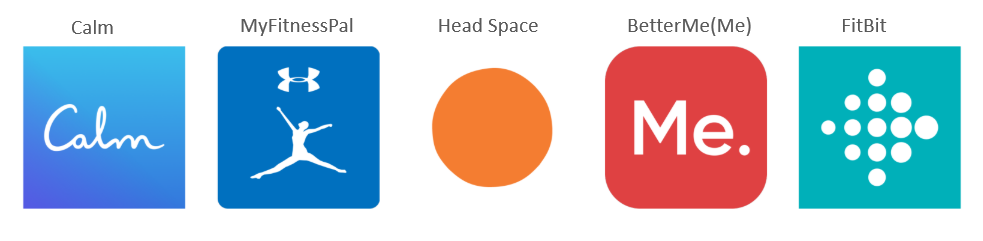
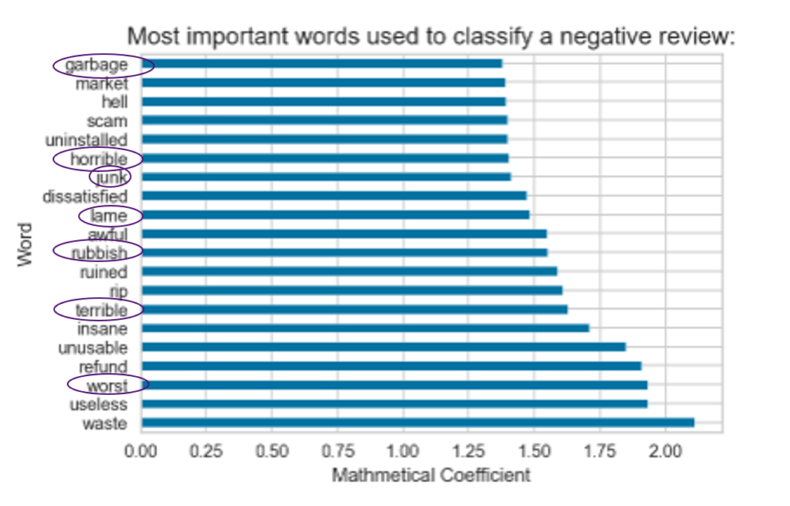
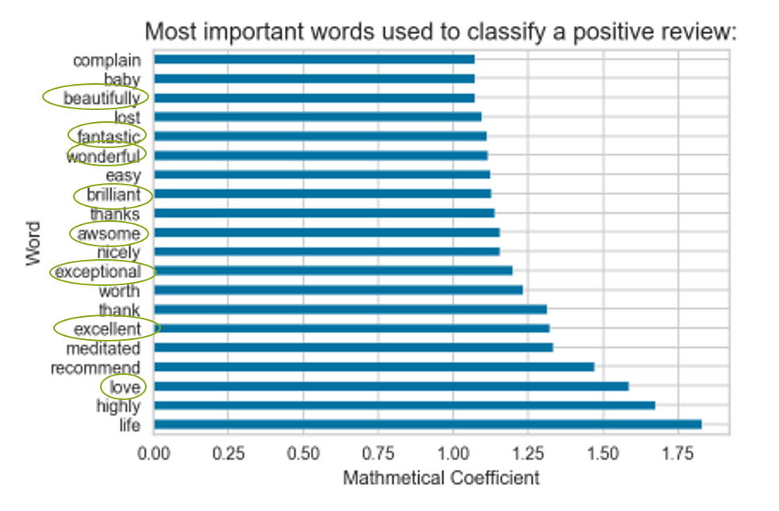
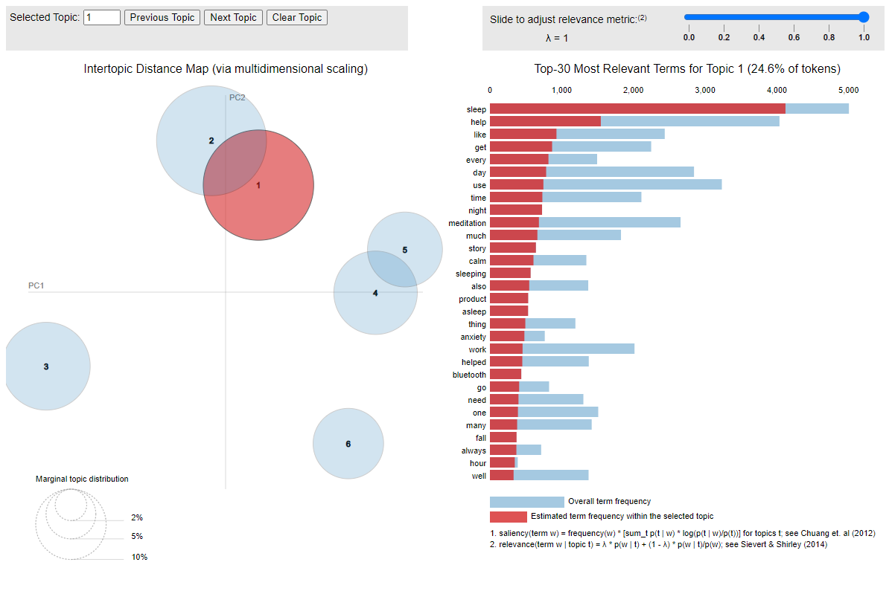
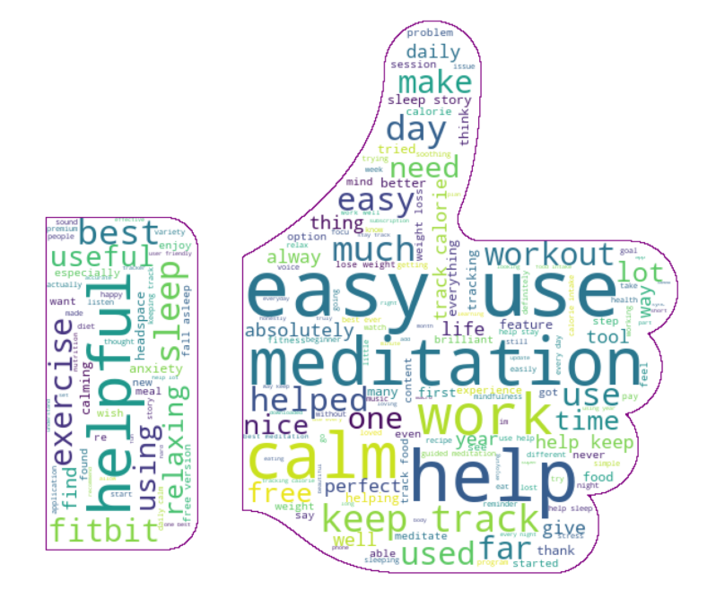
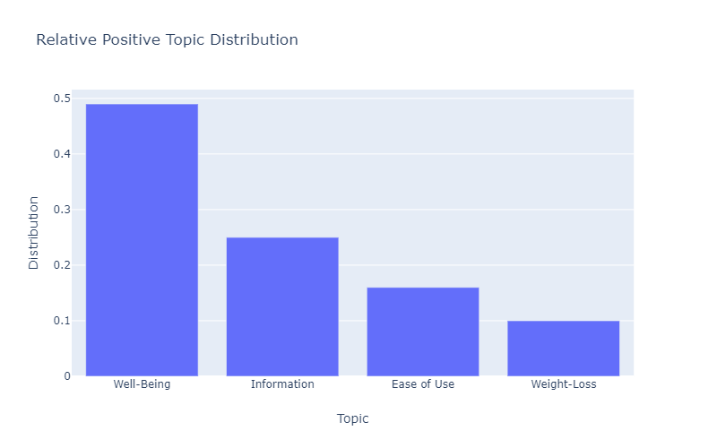
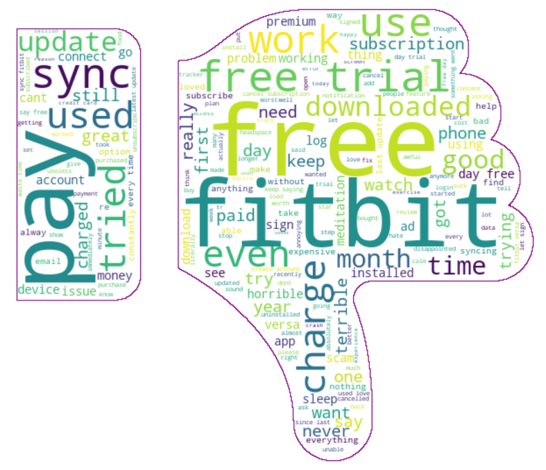
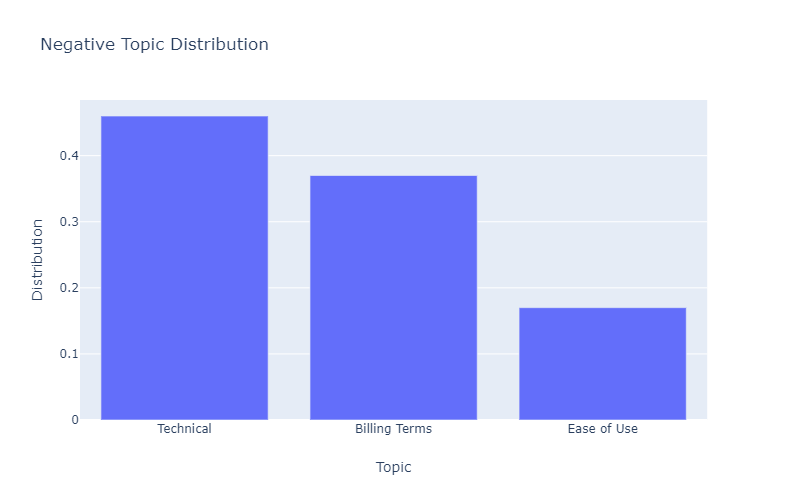

# Natural Language Processing (NLP) using Multi-Classification Support Vector Modeling for Sentiment Analysis & Clustering / Segmentation using Latent Dirichlet Allocation (LDA):

# Main Files:
* wellnessappreview.ipynb - main notebook with code, eda and findings
* appreviews.pdf - non-technical presentation (also available in .pptx)
* htmls/pos_vis.html, htmls/neg_vis.html - interactive LDA modeling to show outcomes

## Abstract: 
A comparative analysis of top 5 grossing health/wellness apps using
**Natural Laguage Processing (NLP)** and linear **Support Vector Classification** for positive and negative sentiment analysis. 
As well as
**Latent Dirchilet Application (LDA) clustering for deep sentiment analysis** to inform best practices and growth opportunities the world of wellness apps.

**Business Case/Problem** App reviews can increase conversion rates - higher rated apps are more attractive to reviewers. Gaining insight from these reviews can provide business intelligence for process improvements and future iterations of products.
> **Questions to be answered:**
* What are the top grossing health and wellness apps? 
* What's in a positive review versus a negative review?
* What insight can be gleaned from reviews to provide business intelligence for next-gen apps?

**Methodology** Natural Language Processing using a multinomal linear Support Vector Classification model was applied to identify positive and negative reviews with baseline values of 40% and 28% to realize 92% and 85% recall respectively and 74% accuracy. While terms used to identify positive an negative reviews like 'awesome' and 'horrible' were helpful in the classifier, they were not useful to identify business insights for improvements and how best to maximize existing offerings. With these adjectives stripped from the corpus, overall model performance decreased. The highest and lowest rating reviews were analyzed separately to more deeply evaluate sentiment to identify possible segments or topics and gain business intelligence.  Various methodologies were used for sentiment analysis including KMeans Clustering, visualization and Latent Dirichlet Allocation or [LDA](https://ai.stanford.edu/~ang/papers/jair03-lda.pdf).  LDA provided the greatest insights to what reviewers were talking about and details and an interactive tool can be found in the Negative Reviews section and Positive Reviews sections of the notebook.

**Findings** The top five grossig health/wellness apps in order from left to right are:

As mentioned before, once negative and positive sentiment was classified, it became apparent that what was helpful to classify the reviews as 'good' or 'bad' were not too informative for gaining product improvement insight:

    

Cluster segment analysis was conducted on negative and positive segments individually used to identify topics using Latent Dirichlet Allocation (LDA).  This revealed various topics and areas of focus by the terms used in each cluster.

___
**Positive review results: (highest rated),**
Non-additive adjectives were removed from the corpus of the positive reviews and further analysis was conducted.

4 main areas were identified:

Examples of terms used most frequently in each topic are below:
|Area | Terms |
|:---| :---|
|Well-Being | 'meditation', 'sleep', 'workout' |
|Information |'information', 'monitor', 'report', 'result'|
|Ease of Use |'track', 'easy', 'keep', use'|
|Weight-Loss|'weight', 'lose', 'active', log'|

It's not surprising that app-specific features around well-being involving mediation, sleep, and workouts as well as weight-loss were what people were talking about most freqently in positive reviews, and that users liked being informed.  Ease of use came up as a topic - again, not surprising but informative as being relevant in a positive review.  These are all reasons why users would seek an app in the first place.  
An interactive tool to visualize the topics can be found in this repo under htmls/pos_vis.html

___
**Negative review results: (lowest rated)***

Non-additive adjectives were removed from the corpus of the negative reviews and further analysis was conducted.

3 main areas were identified: 

Examples of terms used most frequently in each topic are below:
|Area | Terms |
|:---| :---|
|Technical | 'log', 'sync', 'error' , 'device'|
|Billing Terms| 'free', 'trial', 'pay', 'subscription'|
|Ease of Use | 'alarm', 'easy', 'nope', 'friendly'|

Technical issues were the main topic of discussion in the negative reviews.  Issues with syncing devices along with logins were frequently discussed.  Surprisingly - billing terms were close behind technical in one-star reviews.  Users main complaints were being billed after a free trial or having issues with how they were being charged.  Ease of use came up again in the negative reivews, underlining the point that this is important to users.

*An interactive tool to visualize the topics can be found in this repo under htmls/neg_vis.htmls

> After reviewing both the positive and negative reviews separately, the findings would support the following **recommendations** for health/wellness app makers:

1) Exploit app-specific features like well-being (mediation, sleep) or weight loss features.
2) Improve access to relevant information to keep users best informed.
3) Resolve technical issues, syncing / updates 
4) Be clear on billing terms 
5) Maximize ease of uses for features since it was a topic in positive as well as negative reviews

# Background: 

Mobile or **mHealth** is defined by the [WHO](https://www.who.int/goe/publications/goe_mhealth_web.pdf) as the “medical and public health practice supported by mobile devices, such as mobile phones, patient monitoring devices, personal digital assistances and other wireless devices”.  

[According to Grand View Research](https://www.grandviewresearch.com/press-release/global-mhealth-app-market) The global mHealth app market is projected to register a compound annual growth rate of 44.7% by 2027 forecasted at  $236. billion USD.  Increased adoption of technology coupled with the availability of mobile applications for users is witnessing a rapid growth, especially healthcare apps that assist consumers in self-management of disease, wellness, and chronic conditions. Rapid growth in chronic diseases along with the rise in the number of app users is accountable for the mHealth apps market growth.  These apps are comprised of fitness, lifestyle management, nutrition and diet, women’s health, medication adherence, healthcare providers, and disease management. Of these, the fitness category accounted for the majority of segment share in 2018. According to Wired, a mobile advertising and analytics platform, women are more inclined toward tracking their health than men.

Reviews are important to consumers.  Nearly [95 percent of shoppers](https://spiegel.medill.northwestern.edu/online-reviews/) read online reviews before making a purchase .  In fact, one-to-one peer recommendations, original research, and product reviews are [the most influential content](https://contentmarketinginstitute.com/wp-content/uploads/2017/07/smartbrief-content-marketing-institute-how-content-influences-purchasing-process-research.pdf) in affecting purchase decisions.  Reviews can not only boost business, they can inform what is being done well, and what can be done to improve products and services.  

[App Annie](https://www.appannie.com/apps/google-play/top-chart/?country=US&category=19&device=&date=2020-04-05&feed=All&rank_sorting_type=rank&page_number=0&page_size=100&table_selections=) is a decision-making platform for the mobile app economy. App Annie combines the analytics of one's own apps with a granular understanding of the competition and market to provide a unique 360-degree view of one's mobile business.  It was used in  combination with [google play scraper](https://pypi.org/project/google-play-scraper/) to obtain the data for this project. 

Additional reading/resources:

* https://www.itproportal.com/features/the-wellness-industry-is-a-leader-in-mobile-app-development/ 
* https://imtinnovation.com/digital-health/health-and-wellness-apps 

  ___
*Inspired by: https://www.curiousily.com/posts/create-dataset-for-sentiment-analysis-by-scraping-google-play-app-reviews-using-python/ SEVERAL copies of this same project exist in various formats by various authors.

